# What’s MLP?
AI의 궁극적인 목표란 무엇인가?

→ Real world에 존재하는 complex한 function을 잘 approximate하고자 하는 것.

→ 그걸 하기 위한 가장 기초적인 모델이 MLP이다.

## Universal Approximation Theorm (UAT)
한 층의 Hidden Layer와 그에 대한 Non-Linear Activation만 있다면, 어떠한 Continuous Function도 approximate이 가능하다.
→ MLP에서 Matrix Multiplication - Activation - Matrix Multiplication을 하는 이유

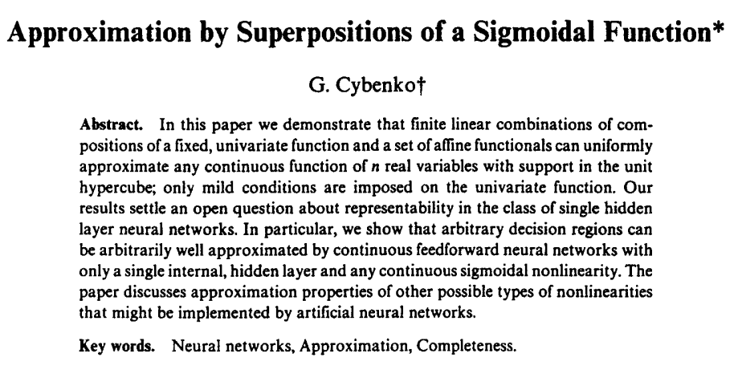
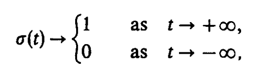

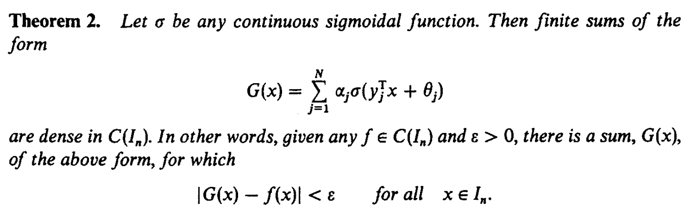

- $\sigma$ 는 어떤 continuous 한 sigmoidal function이면 된다. 
	ex) Sigmoid, Hyperbolic Tangent, …
- $x$ 는 $n$ 차원의 input
- $\theta$ 는 bias
- $y_j$ 는 weight
- $\alpha_j$ 를 마지막에 곱하면 어떤 함수던 만들 수 있다.

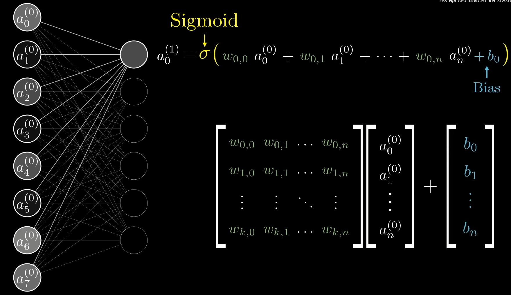

> [!Tips] Activation이 없어지면 생기는 일
> UAT에서도 activation function이 필요하다고 증명이 됐지만, 구체적인 예시를 통한 설명은 아래에 있다.
> 
> [Machine-Learning/Toy-Models-of-Superposition/Why-does-it-happen](https://rhqo.github.io/Machine-Learning/Toy-Models-of-Superposition/Why-does-it-happen)
> 
> 결론은 Weight matrix에 자유도를 부여하는 역할이라고 생각한다.

다음은 hidden layer의 neuron의 갯수가 3일 때, 임의의 함수 f를 만드는 과정이다.

Hidden layer의 neuron 갯수가 3라고 가정. (N=3)
$$

y = \alpha_1\text{ReLU}(f_1(x)) + \alpha_2\text{ReLU}(f_2(x)) + \alpha_3\text{ReLU}(f_3(x))

$$

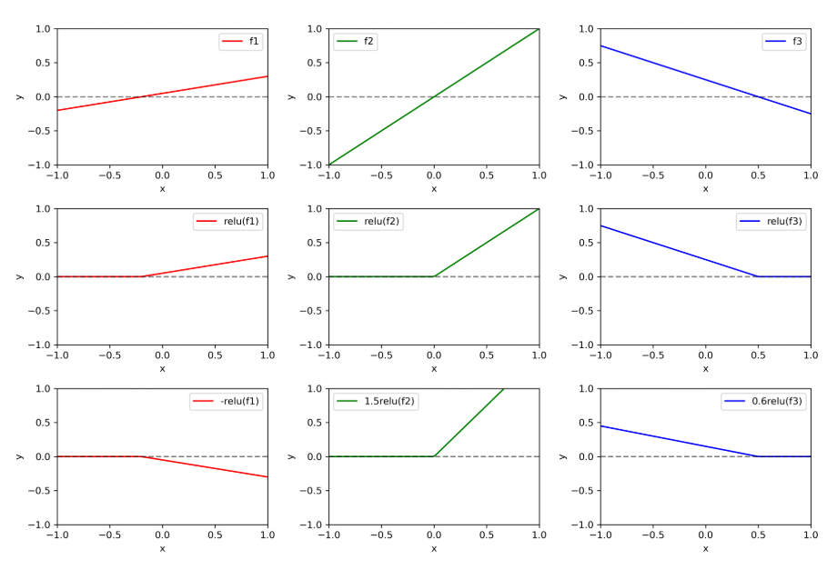  
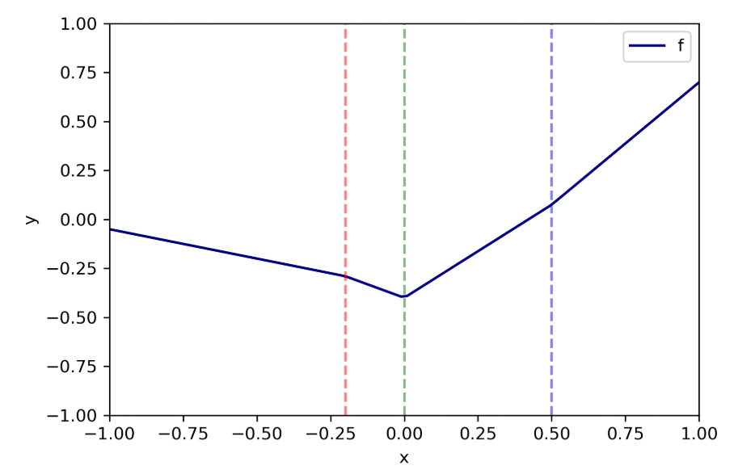
## MLP

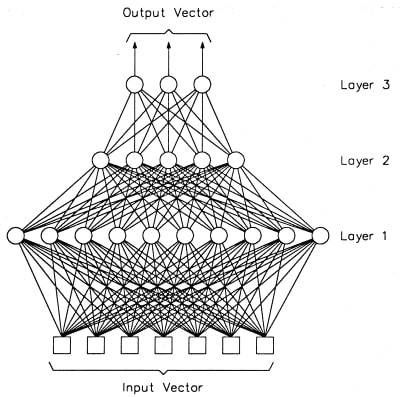


FC Layer, Feed Forward Network, Dense Layer, Projection Layer, … 모두 비슷하지만, 상황에 따라 쓰는 용어가 다르다.

FC Layer는 Layer 내부의 Perceptron은 이전 Layer의 모든 출력값을 입력값으로 하는 것, …

MLP는 FC Layer+Activation function이 여러(multi) 개
```python
import torch
import torch.nn as nn
import torch.nn.functional as F

class MLP(nn.Module):
	def __init__(self, input_size, hidden_size1, hidden_size2, output_size):
		super(MLP, self).__init__()
		self.fc1 = nn.Linear(input_size, hidden_size1)
		self.fc2 = nn.Linear(hidden_size1, hidden_size2)
		self.fc3 = nn.Linear(hidden_size2, output_size)
	
	def forward(self, x):
		x = F.relu(self.fc1(x))
		x = F.relu(self.fc2(x))
		x = self.fc3(x)
		
		return x

model = MLP(input_size=784, hidden_size1=128, hidden_size2=64, output_size=10)

print(model)
```


### Why Layer’s’?

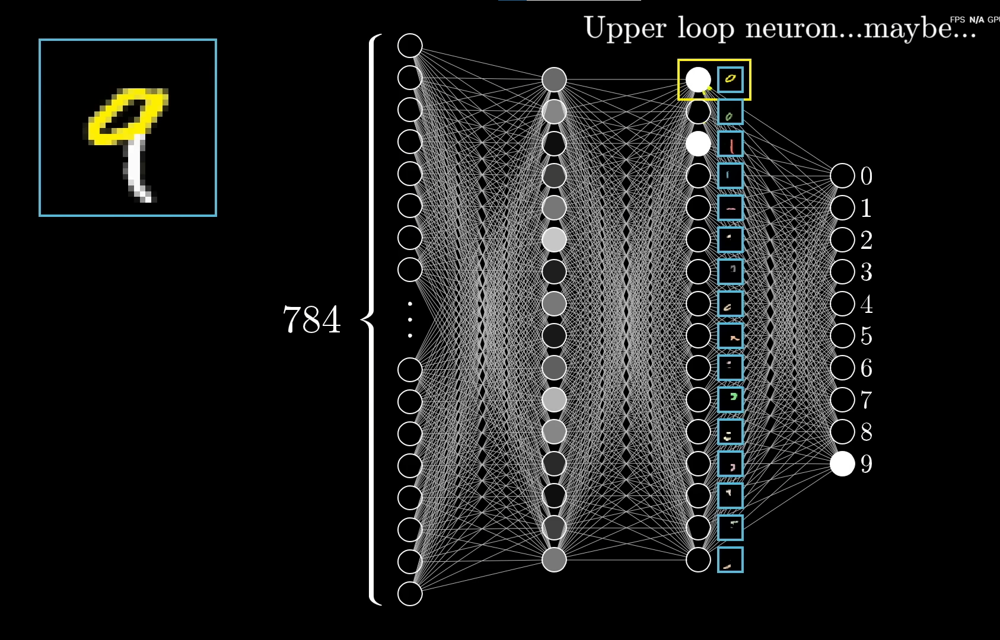

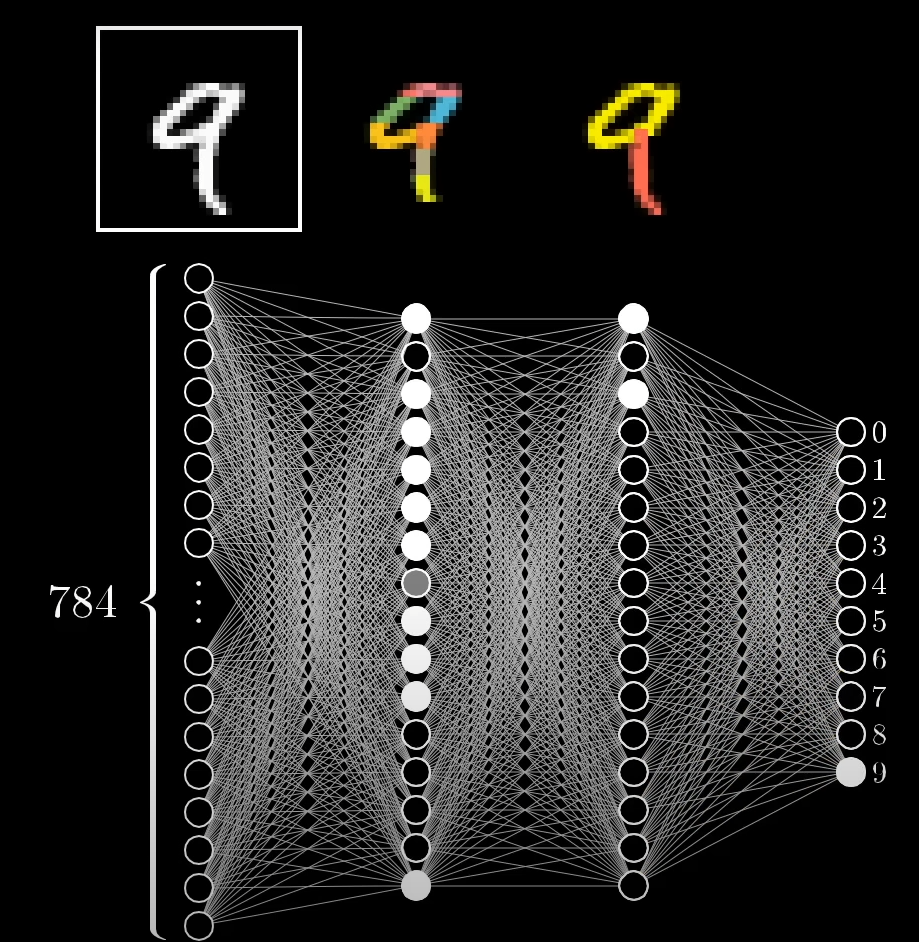

pixel → edge → pattern → digit

⇒ 정리하면, **Layer가 많아질수록(깊어질수록) 더 복잡한 패턴과 표현 학습 가능한 모델이라고 볼 수 있다.**
### Why Neuron’s’?
왜 2차원의 정보를 3차원, 혹은 그 이상의 차원에 저장할까?

Overcomplete basis
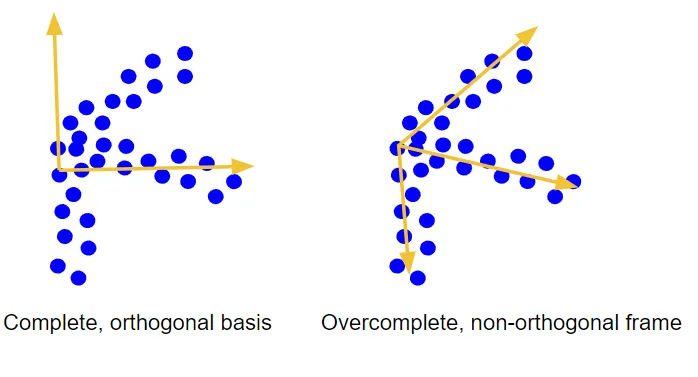 
(Example of a set of points/vectors that cannot be represented well by any two orthogonal vectors, but on the other hand three frame vectors describe this set pretty well.)

위 같은 데이터 구조에서는 직교하는 2개의 basis보다, 3개의 basis가 데이터를 표현하기 쉬울 것.


CNN이 여러 특징들을 표현하는 방식도 overcomplete basis로 볼 수 있다.

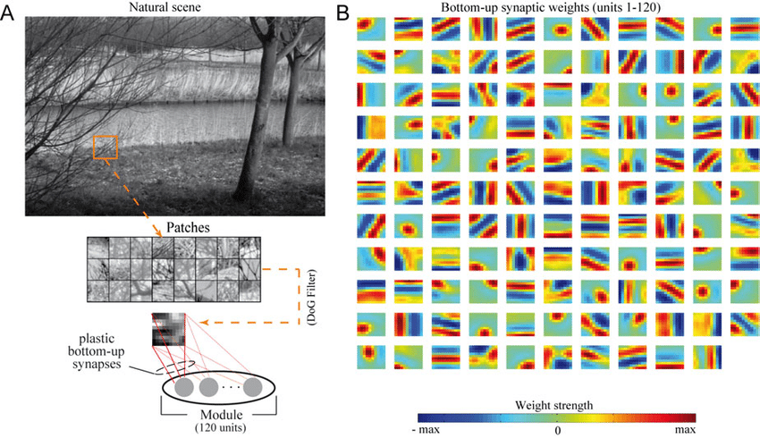
(Unsupervised formation of an overcomplete basis for natural image patches)


각 뉴런이 어떤 역할을 수행하는지는 toy models of superposition에서 설명 시도함

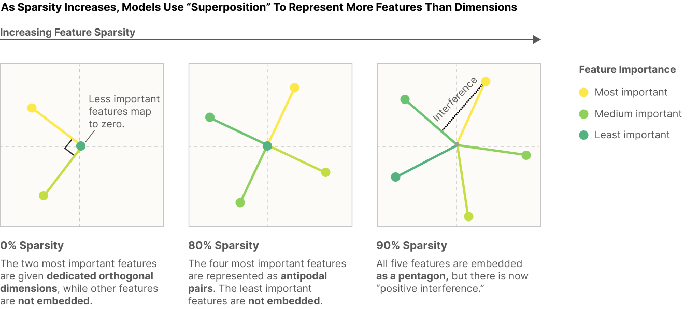
"언제, 어떻게 모델이 차원에 비해 더 많은 feature를 표현할 수 있는가"에 대한 고찰

⇒ 정리하자면, **뉴런 수는 해당 Layer가 표현할 수 있는 정보의 차원 수와 복잡도라고 볼 수 있다.**


### Reference
- Cybenko, George. "Approximation by superpositions of a sigmoidal function." _Mathematics of control, signals and systems_ 2.4 (1989): 303-314.
- [3Blue1Brown - But what is a neural network? | Deep learning chapter 1](https://www.youtube.com/watch?v=aircAruvnKk&list=PLZHQObOWTQDNU6R1_67000Dx_ZCJB-3pi)
- [Deepest Documentation - Multi-Layer Perceptron](https://deepestdocs.readthedocs.io/en/latest/004_deep_learning_part_2/0040/)
- Overcomple Basis - [bartwronski - Compressing PBR material texture sets with sparsity and k-SVD dictionary learning](https://bartwronski.com/2020/08/30/compressing-pbr-texture-sets-with-sparsity-and-dictionary-learning/)
- CNN weights - [Unsupervised formation of an overcomplete basis for natural image patches](https://www.researchgate.net/figure/Unsupervised-formation-of-an-overcomplete-basis-for-natural-image-patches-A-Learning_fig27_209473897)
- [Anthropic - Toy Models of Superposition](https://transformer-circuits.pub/2022/toy_model/index.html)