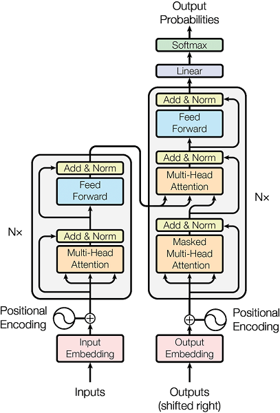
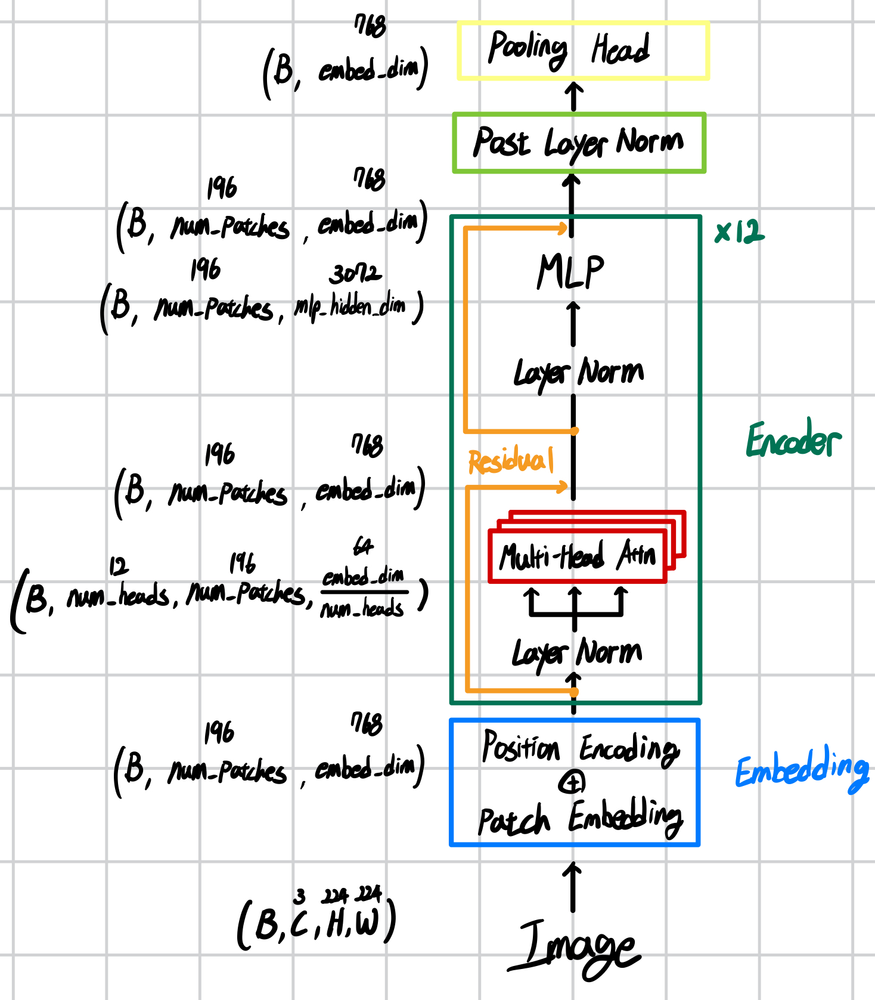
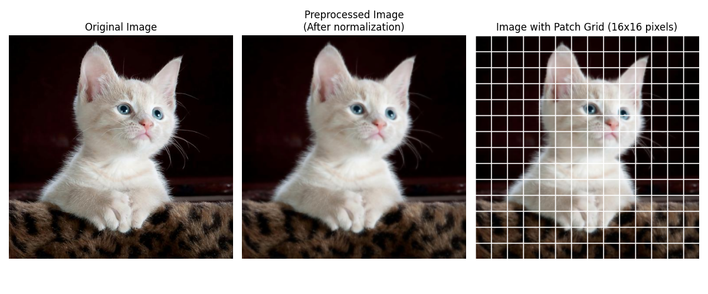
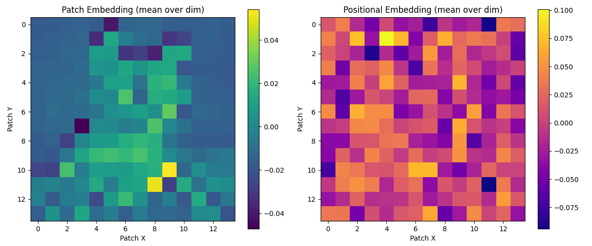
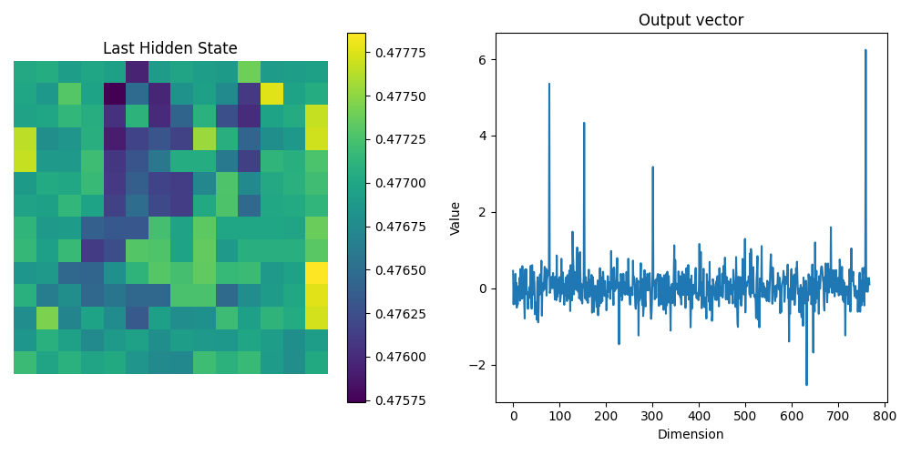

[Attention Is All You Need](https://arxiv.org/abs/1706.03762) \
[GitHub - Rhqo/siglip-from-scratch](https://github.com/Rhqo/siglip-from-scratch)

> 기존의 sequence transduction model들은 encoder와 decoder를 포함하는 복잡한 RNN 혹은 CNN 기반이 주를 이뤘다. \
> 성능이 가장 우수한 model들은 또한 encoder와 decoder를 attention mechanism으로 연결한다. \
> 우리는 recurrence와 convolution을 완전히 배제하고 attention mechanism만으로 구성된 새로운 simple network architecture인 Transformer를 제안한다.




**Encoder**
1. Input Embedding
2. Positional Encoding
3. Multi-Head Attention
4. Add & Normalization
5. Feed Forward Network

**Decoder**
1. Output Embedding
2. Positional Encoding
3. Multi-Head Attention
4. Add & Normalization
5. Feed Forward Network
6. Softmax

Transformer의 구조를 순서대로, Top-down 방식으로 알아보고자 한다.

Transformer는 언어 모델을 위해 만들어졌지만, 후에는 이게 [ViT](https://arxiv.org/abs/2010.11929)로 vision transformer로도 사용된다.

ViT를 포함하여, vision task에서의 transformer는 주로 encoder only 구조를 가진다.

Encoder 구조에 대한 코드는 ViT의 구조를 사용하는 [SigLip](https://arxiv.org/abs/2303.15343)의 코드를 통해 설명하고,

Decoder 구조에 대한 코드는 직접 작성하여 설명한다.

> [!Tips] [[Why Transformer?]]

# Encoder Only - SigLip


  
## 0. Image Preprocessing



Image Preprocessing 과정은 이미지를 적절한 형태의 tensor로 변환하는 과정이다.

이미지는 text처럼 토큰단위로 나뉘어 있지 않기 때문에, vision에서 transformer를 사용하기 위해서는 이미지를 tensor로 변환하고 patch size로 나누는 과정이 필요하다.

PIL로 불러온 이미지를 tensor 형태로 변환한다.

이미지의 pixel 수를 (224, 224)로 설정하고, tensor 형태로 변환한다.

이미지의 각 채널(RGB)에 평균과 표준편차를 사용하여 정규화를 적용하는데,

여기서 사용된 값들은 ImageNet 데이터셋에서 계산된 통계값으로, 많은 pretrained 모델에서 표준으로 사용된다.

여기에 배치 차원 추가하여, 최종 tensor의 형태는 (3, 224, 224) → (1, 3, 224, 224)가 된다.
```python
def preprocess_image(image, image_size=224):
    preprocess = transforms.Compose([
        transforms.Resize((image_size, image_size)),
        transforms.ToTensor(),
        transforms.Normalize(
            mean=[0.485, 0.456, 0.406],
            std=[0.229, 0.224, 0.225]
        )
    ])

    image_tensor = preprocess(image)
    # Add batch dimension (3, 224, 224) -> (1, 3, 224, 224): (B, C, H, W)
    image_tensor = image_tensor.unsqueeze(0)

    return image_tensor
```
## 1. Input Embedding

Input Embedding 과정에는 tensor를 patch로 나눠서 embedding하는 부분과 positional encoding하는 부분이 포함된다.



→ 각 patch마다 768차원 정보 담겨있다. mean을 사용해서 시각화.

### Patch Embedding

> [!Tips] [[Why Patch Embedding?]]

Tensor를 여러 조각의 patch로 나누고, 각각의 patch를 $W_{tokenize}$ 의 weight을 통해 token(patch_embedding)으로 변환하는 과정이므로, stride가 kernel 사이즈와 같은 convolution 연산, Conv2d를 사용하여 구현이 가능하다. \
(B, 3, 224, 224) → (B, 768, 14, 14)

patch_embedding의 마지막 두 요소를 flatten, tensor의 형태가 (B, T, C)형태가 되도록 transpose한다. \
(B, 768, 14, 14) -> (B, 768, 196) -> (B, 196, 768)

### Positional Encoding

> [!Tips] [[Why Positional Encoding?]]

torch의 Embedding 함수는 숫자 인덱스를 고차원 벡터로 변환하는 룩업 테이블과 같은 역할을 한다.

Embedding(169, 768)과 같이 설정하면, 169개의 패치에 대해 각각 768차원의 임베딩 벡터를 학습한다.

각 패치에는 0부터 168까지의 고유 인덱스가 이미 할당되어 있고,

Embedding 함수는 이 인덱스들을 의미 있는 위치 정보를 담은 벡터로 변환하는 역할을 한다.

최종적으로 patch embedding의 결과와 positional encoding의 결과를 더한다.
```python
class VisionEmbeddings(nn.Module):
    def __init__(self, config: SigLipVisionConfig):
        super().__init__()
        self.config = config

        self.num_channels = config.num_channels
        self.embed_dim = config.embed_dim
        self.image_size = config.image_size
        self.patch_size = config.patch_size

        self.patch_embedding = nn.Conv2d(
            in_channels=self.num_channels,
            out_channels=self.embed_dim,
            kernel_size=self.patch_size,
            stride=self.patch_size,
            padding="valid"
        )

        self.num_patches = (self.image_size // self.patch_size) ** 2
        self.num_positions = self.num_patches
        self.position_embedding = nn.Embedding(self.num_positions, self.embed_dim)
        # register_buffer : training X, state maintain
        # self.position_ids = torch.arange(self.num_positions).expand((1, -1))
        self.register_buffer(
            "position_ids",
            # (1, 196)
            torch.arange(self.num_positions).expand((1, -1)),
            persistent=False
        )

    def forward(self, pixel_values: torch.FloatTensor) -> torch.Tensor:
        B, C, H, W = pixel_values.shape

        # (B, 3, 224, 224) -> (B, 768, 14, 14)
        patch_embeds = self.patch_embedding(pixel_values)
        # (B, 768, 14, 14) -> (B, 768, 196) -> (B, 196, 768)
        embeddings = patch_embeds.flatten(-2, -1).transpose(1, 2)
        # 196 patches, 768-dimension vector
        embeddings = embeddings + self.position_embedding(self.position_ids)

        return embeddings
```
## 2. Encoder

Encoder는 입력 patch들이 서로 어떻게 연결되는지 파악하고, 이미지의 전체적인 의미와 맥락을 이해하는 역할을 수행한다.

Encoder Block은 multi-head self attention과 layer normalization, feed forward network로 구성된다.

Layer normalization을 언제 하는지에 따라서, pre-norm과 post-norm 방식이 있다. ([On Layer Normalization in the Transformer Architecture](https://arxiv.org/abs/2002.04745)

SigLip 등의 ViT의 경우엔 pre-norm을 사용한다.

Norm → Multi-head self attention → Residual connection → Norm → FFN → Residual connection 의 순서로 진행된다.

Encoder는 입력 dimension과 출력 dimension이 같기 때문에, 여러번 사용가능하다.

실제로 많은 모델에서 이를 반복해서 사용하며, SigLip Encoder도 마찬가지로 num_encoder_blocks만큼 반복하여 사용한다.

대표적인 Encoder 반복의 예시로는 [BERT](https://arxiv.org/abs/1810.04805)가 있다.
```python
class EncoderBlock(nn.Module):
    def __init__(self, config: SigLipVisionConfig):
        super().__init__()
        self.config = config
        self.embed_dim = config.embed_dim
        self.layer_norm1 = nn.LayerNorm(self.embed_dim, eps=config.layer_norm_eps)
        self.self_attn = MultiheadAttention(config)
        self.layer_norm2 = nn.LayerNorm(self.embed_dim, eps=config.layer_norm_eps)
        self.mlp = MLP(config)     

    def forward(self, x):
        residual = x
        x = self.layer_norm1(x)   # Layer Normalization (Pre-norm)
        x = self.self_attn(x)     # Multi-Head Attention
    
        x = x + residual          # Add (Residual connection)
        residual = x
        x = self.layer_norm2(x)   # Normalization
        
        x = self.mlp(x)           # Feed Forward Network
        x = x + residual          # Add (Residual connection)

        return x
        
class SigLipEncoder(nn.Module):
    def __init__(self, config: SigLipVisionConfig):
        super().__init__()
        self.config = config
        self.num_encoder_blocks = config.num_encoder_blocks
        self.encoder_blocks = nn.ModuleList([EncoderBlock(config) for _ in range(self.num_encoder_blocks)])

    def forward(self, x):
        for block in self.encoder_blocks:
            x = block(x)
        return x
```

## 3. Multi-Head Attention

> [!Tips] [[Why Multi-Head Attention?]]

Multi-Head Attention은 encoder와 decoder에서 입력 시퀀스의 각 요소가 다른 요소들과 어떻게 관련되어 있는지를 모델링하는 핵심 구조이다.

입력 시퀀스에서 Linear(fully connected) layer를 사용하여 query Q, key K, value V를 생성한다.

Q, K, V의 각 768차원 벡터를 12개의 64차원 벡터로 분할하고, transpose로 head 차원을 시퀀스 앞으로 이동 \
(B, 196, 768) → (B, 196, 12, 64) → (B, 12, 196, 64)

Q, K의 dot product @를 통해 attention score 계산, K의 dimension으로 나눈다. (scaled dot product) \
(B, 12, 196, 64) @ (B, 12, 64, 196) → (B, 12, 196, 196)

행렬에 softmax를 취해서 확률로 변환한 후, V와 dot product를 수행한다. \
softmax((B, 12, 196, 196)) → (B, 12, 196, 196) @ (B, 12, 196, 64) → (B, 12, 196, 64)

$$

\text{Attention(Q, K, V)}=\text{softmax}\left(\frac{QK^T}{\sqrt{d_K}}\right)V

$$

마지막으로 transpose, reshape ($Concat$) 한 후, linear layer $W^O$ 거치면 attention의 최종 결과를 구할 수 있다. \
(B, 12, 196, 64) → (B, 196, 12, 64) → (B, 196, 768) → (B, 196, 768)

$$
MultiHead(Q, K, V) = Concat(head_1, ..., head_h)W^O \\
\\
\text{where } head_i = Attention(QW^Q_i, KW^K_i, VW^V_i)
$$

![[Transformer_4.png|500]]
![[Transformer_7.png|250]]

![[Transformer_5.png | 400]]

```python
class MultiheadAttention(nn.Module):
    def __init__(self, config: SigLipVisionConfig):
        super().__init__()
        self.config = config

        self.embed_dim = config.embed_dim
        self.num_heads = config.num_attention_heads
        self.dropout = config.attention_dropout

        self.k_proj = nn.Linear(self.embed_dim, self.embed_dim)
        self.v_proj = nn.Linear(self.embed_dim, self.embed_dim)
        self.q_proj = nn.Linear(self.embed_dim, self.embed_dim)
        self.out_proj = nn.Linear(self.embed_dim, self.embed_dim)

    def forward(self, x):
        # x : (batch_size, num_patches, embed_dim)
        # (B, 196, 768)
        B, T, C = x.shape

        # proj : (B, 196, 768)
        q_proj = self.q_proj(x)
        k_proj = self.k_proj(x)
        v_proj = self.v_proj(x)

        # 12 heads, 196 patches, 64-dimension vector
        # states : (B, 196, 768) -> (B, 196, 12, 64) -> (B, 12, 196, 64)
        q_states = q_proj.reshape(B, T, self.num_heads, C // self.num_heads).transpose(1, 2)
        k_states = k_proj.reshape(B, T, self.num_heads, C // self.num_heads).transpose(1, 2)
        v_states = v_proj.reshape(B, T, self.num_heads, C // self.num_heads).transpose(1, 2)

        # (B, 12, 196, 64) @ (B, 12, 64, 196) -> (B, 12, 196, 196)
        attention_scores = q_states @ k_states.transpose(-2, -1) * (k_states.size(-1) ** -0.5)
        attention_probs = F.softmax(attention_scores, dim=-1).to(q_states.dtype)
        attention_probs = F.dropout(attention_probs, p=self.dropout, training=self.training)

        # (B, 12, 196, 196) @ (B, 12, 196, 64) -> (B, 12, 196, 64)
        attention_out = attention_probs @ v_states
        # (B, 12, 196, 64) -> (B, 196, 12, 64) -> (B, 196, 768)
        attention_out = attention_out.transpose(1, 2).reshape(B, T, C)
        attention_out = self.out_proj(attention_out)

        return attention_out
```
## 4. Multi-head Attention Pooling Head

SigLip을 비롯한 최신 ViT 사용 연구들은 CLS token 대신 MAP head(Multihead Attention Pooling Head)를 사용한다.

MAP 헤드는 multi-head attention mechanism을 사용하여 patch token들의 정보를 종합해 하나의 이미지 representation으로 만든다.

이는 CLS 토큰처럼 단일 특수 토큰에 모든 정보를 압축하는 것과 달리, attention mechanism을 통해 모든 패치의 정보를 고려하여 더 효과적인 이미지 representation을 만들어 낼 수 있다.
```python
class MultiheadAttentionPoolingHead(nn.Module):
    def __init__(self, config: SigLipVisionConfig):
        super().__init__()

        self.probe = nn.Parameter(torch.randn(1, 1, config.embed_dim))
        self.attention = torch.nn.MultiheadAttention(config.embed_dim, config.num_attention_heads, batch_first=True)
        self.layernorm = nn.LayerNorm(config.embed_dim, eps=config.layer_norm_eps)
        self.mlp = MLP(config)

    def forward(self, hidden_state):
        batch_size = hidden_state.shape[0]
        probe = self.probe.repeat(batch_size, 1, 1)

        hidden_state = self.attention(probe, hidden_state, hidden_state)[0]

        residual = hidden_state
        hidden_state = self.layernorm(hidden_state)
        hidden_state = residual + self.mlp(hidden_state)

        return hidden_state[:, 0]
```
## 5. Vision Transformer

지금까지의 모듈들을 하나로 합치는 과정이다.

(Pre-processing) → VisionEmbeddings → Encoder → Norm → Multi-head Attention Pooling

결과는 마지막 head 전의 last_hidden_state와 최종 output인 768차원 벡터를 모두 반환하도록 구성했다.
```python
class SigLipVisionTransformer(nn.Module):
    def __init__(self, config: SigLipVisionConfig):
        super().__init__()
        self.config = config

        self.embeddings = VisionEmbeddings(config)
        self.encoder = SigLipEncoder(config)
        self.post_layernorm = nn.LayerNorm(config.embed_dim, eps=config.layer_norm_eps)
        self.attn_pooling_head = MultiheadAttentionPoolingHead(config)

    def forward(self, pixel_values):
        # (B, 3, 224, 224) -> (B, 196, 768)
        embeddings = self.embeddings(pixel_values)
        # (B, 196, 768) -> (B, 196, 768)
        encoder_out = self.encoder(embeddings)
        last_hidden_state = self.post_layernorm(encoder_out)
        # (B, 196, 768) -> (B, 768)
        out = self.attn_pooling_head(last_hidden_state)
        return [last_hidden_state, out]
```

Last Hidden State: (1, 196, 768) → 196 patches, 768 dimension \
Output Vector: (1, 768) → 768 dimension

## Masked Multi-Head Attention


$$

\text{Masked\ Attention(Q, K, V)}=\text{softmax}\left(\frac{QK^T}{\sqrt{d_K}}+M\right)V

$$


### Reference
- [Transformer](https://arxiv.org/abs/1706.03762) - Vaswani, Ashish, et al. "Attention is all you need." _Advances in neural information processing systems_ 30 (2017).
- [ViT](https://arxiv.org/abs/2010.11929) - Dosovitskiy, Alexey, et al. "An image is worth 16x16 words: Transformers for image recognition at scale." _arXiv preprint arXiv:2010.11929_ (2020).
- [SigLip](https://arxiv.org/abs/2303.15343) - Zhai, Xiaohua, et al. "Sigmoid loss for language image pre-training." _Proceedings of the IEEE/CVF international conference on computer vision_. 2023.
- [On Layer Normalization in the Transformer Architecture](https://arxiv.org/abs/2002.04745) - Xiong, Ruibin, et al. "On layer normalization in the transformer architecture." _International conference on machine learning_. PMLR, 2020.
- [BERT](https://arxiv.org/abs/1810.04805) - Kenton, Jacob Devlin Ming-Wei Chang, and Lee Kristina Toutanova. "Bert: Pre-training of deep bidirectional transformers for language understanding." _Proceedings of naacL-HLT_. Vol. 1. No. 2. 2019.
- [GitHub Code](https://github.com/Rhqo/siglip-from-scratch) - Rhqo/siglip-from-scratch